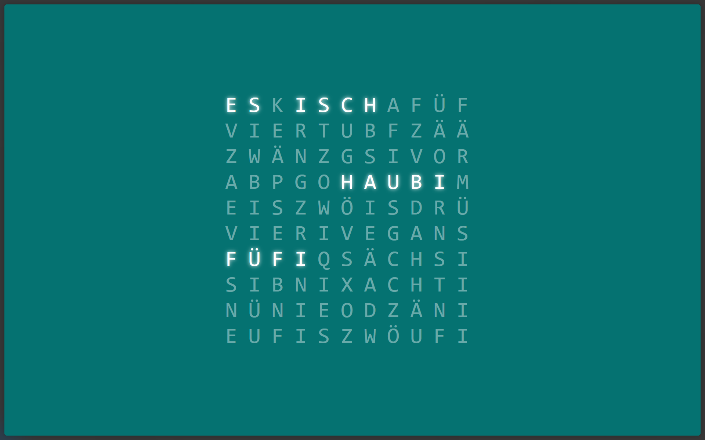

# Word Clock (Wortuhr)

Creates a simple word clock, based on the current time

# Example

This example is generated in swiss german.

# Ideas

 - [ ] Different Languages
 - [ ] Color Setting
 - [ ] Font Setting
 - [ ] Custom Words